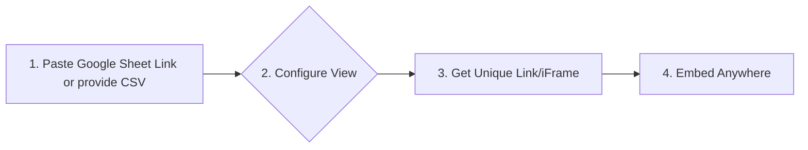

# EdObserver Studio

A proposal for unified operational intelligence at Unlox.

  
    Press Space for next page <carbon:arrow-right />
  

  Tomorrow's Gadget Lab (CC05)

<!-- Welcome everyone. We are Tomorrow's Gadget Lab, and we're here to talk about data-driven decisions. -->
---
layout: default
---

# The Problem: Unlox's Blind Spot

- Siloed data from digital platforms and potential physical centers.
- Lack of real-time, integrated visibility into business performance.
- Difficulty in making cross-functional decisions.
- Delayed tracking of profitability and inefficient resource allocation.
- Risk of service quality degradation across channels.

Our current state of analytics relies on:
- One-off Python `matplotlib` charts.
- Looker Studio dashboards that don't integrate with our ERP.

This leads to a fragmented view of the business, making strategic decisions risky and reactive.

<!-- Emphasize the pain point: we're flying blind and it's costing us. -->

---
layout: default
---

# The Core Question: To Expand or Not to Expand?

A critical strategic question for Unlox is whether to expand into physical training centers within the next 12-24 months.

 

This decision is immensely complicated by our current operational constraints.

Without a unified view of our data, we cannot effectively:
- Forecast the profitability of new centers.
- Allocate resources between digital and physical offerings.
- Ensure consistent service quality during expansion.
- Coordinate between digital and physical teams.

<!-- Frame this as the single most important strategic question facing Unlox right now. -->

---
layout: two-cols-header
---

### A Data-Driven Decision

::left::

### Key Placeholder Metrics

| Metric                               | Digital | Physical (Proj. Y1) |
| ------------------------------------ |:-------:|:-------------------:|
| **Profit Margin**                    |   45%   |        -15%         |
| **Customer Acquisition Cost (CAC)**  |   Rs50   |       Rs250        |
| **Market Trend**                     | Growth  |      Contraction    |
| **Operational Complexity**           |   Low   |         High        |

 

Data is simulated for illustrative purposes. Real data is needed for a final decision.

::right::

### Recommendation: Defer Physical Expansion

The data, even in this simplified form, points to a clear conclusion:

1.  **Focus on Profitability:** Our digital offerings are highly profitable. Physical expansion carries significant initial risk and negative returns.
2.  **Optimize Resources:** We should double down on our low-CAC digital channels rather than investing in high-CAC physical locations.
3.  **Follow the Market:** Competitors are shifting to hybrid models, not expanding physical footprints.

**The Verdict:** Strengthen our digital core and data capabilities first. This is where the real opportunity lies.

<!-- Explain that CAC means Customer Acquisition Cost - the price to get one new customer. -->

---
layout: center
class: text-center
---

# Introducing: EdObserver Studio

A simple, efficient, and tasteful dashboarding solution.

It does one job, and does it well: **Provide clear, consolidated metrics for confident decision-making.**

No more hunting for data. No more conflicting reports. Just the insights you need, when you need them.

<!-- Position EdObserver as the direct, logical solution to the problem we just demonstrated. -->

---
layout: two-cols-header
---

# Core Functionality

::left::

### Ease of Use
- **Google Sheets Integration:** Simply paste a public Google Sheets link to import your data.
- *Private sheets and database support planned for V2.*

### Embeddable Insights
- **iFrame & Live Images:** Generate shareable `<iframe>` snippets or live images to embed in any presentation or document.

### Project-Based Workflow
- **Unique IDs:** Every chart or dashboard you create gets a unique, persistent ID for easy access and sharing.

::right::

<iframe src="https://jack-pots.github.io/TGL-CaseCraft-Submission-Website?sheet=https://docs.google.com/spreadsheets/d/1i-o8AmTZYtTI6p5uFLhf9YLOWDoEEToHZkccME2lv0g/" class="rounded-lg" width="400" height="300"</iframe>

Current iteration of EdObserver Studio interface.  (missing many features: Just a Prototype for now!)

https://jack-pots.github.io/TGL-CaseCraft-Submission-Website

<!-- Key takeaways are 'easy', 'embeddable', and 'organized'. The iframe shows a live prototype. -->

---
layout: 'two-cols-header'
---

# Live Demo

We deployed a prototype to jot down what we were imagining with our concept! :D

::left::

<iframe src="https://jack-pots.github.io/TGL-CaseCraft-Submission-Website" class="rounded-lg h-full w-half" </iframe>

::right::

 

<!-- Encourage the audience to scan the QR code and explore the prototype on their own devices. -->

---
layout: default
---

# A Simple, Powerful Workflow

We've designed EdObserver Studio to be as simple as possible.

This streamlined process ensures that employees can get from raw data to actionable insight in minutes, not hours.

<!-- Walk through the four steps to show how quickly users can get value. -->

---
layout: center
class: text-center
---

# The Vision: Beyond Dashboards

EdObserver Studio is more than just a tool; it's the first step towards building a truly data-driven culture at Unlox.

 

With a solid foundation for data consolidation, we can unlock future capabilities like:
- **Full ERP Integration**
- **Predictive Analytics**
- **AI-Powered Insights**

Enabling us to answer the big questions, like physical expansion, with confidence.

<!-- This is the "what's next" - paint a picture of a smarter, more data-fluent Unlox. -->

---
layout: center
class: text-center
---

# Thank You

## Questions?

  Tomorrow's Gadget Lab

<!-- Open the floor for questions and thank them for their time. -->